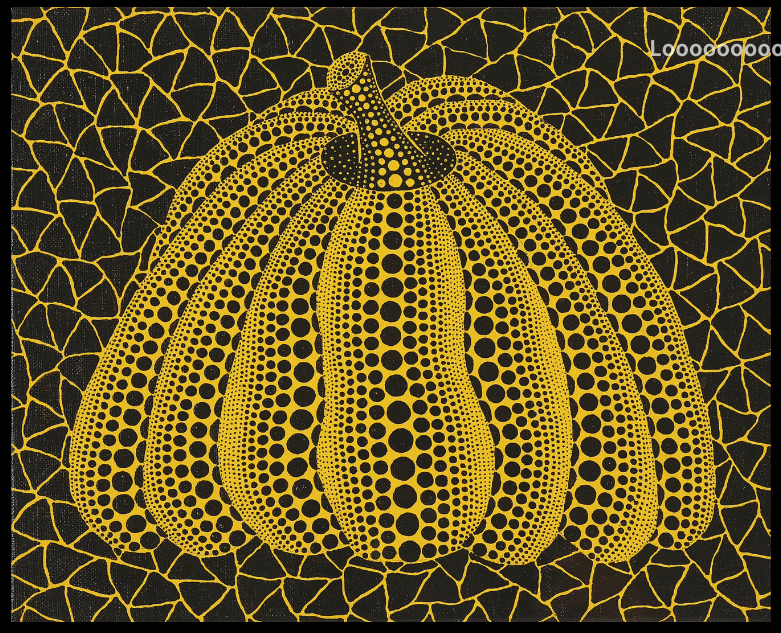
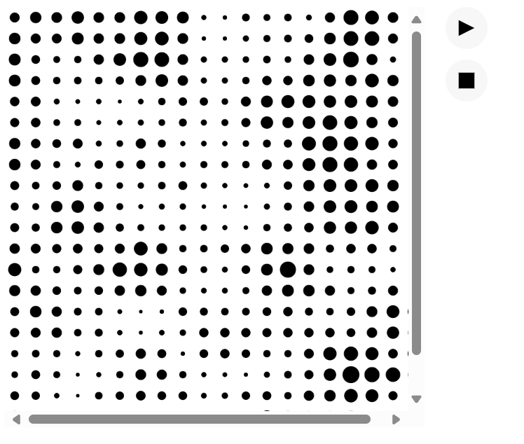

# hwei0634_9103_tut4
## Qiuz 8
### Part 1: Imaging Technique Inspiration
**Yayoi Kusama**'s excellent use of polka dots allows her to give her work a strong sense of emotion and impact, the size and spacing of the polka dots gives the paintings a sense of rhythm. I think that using polka dots in a similar way to Yayoi Kusama's paintings could be a useful technique to help me with my major assignment. I could use polka dots as base graphics to reconstruct these classic paintings.

### Part 2: Coding Technique Exploration
Perlin noise is an algorithm written by Ken Perlin to produce sequences that appear both random and organic. The noise() function in p5 produces Perlin noise. I thought this function would help me achieve a similar polka dot effect. This function generates random dots of varying sizes that give the drawing a vivid texture, and using these dots to fill the shape will allow relatively complex drawings to be made.

[noise() function](https://p5js.org/examples/repetition-noise/)
